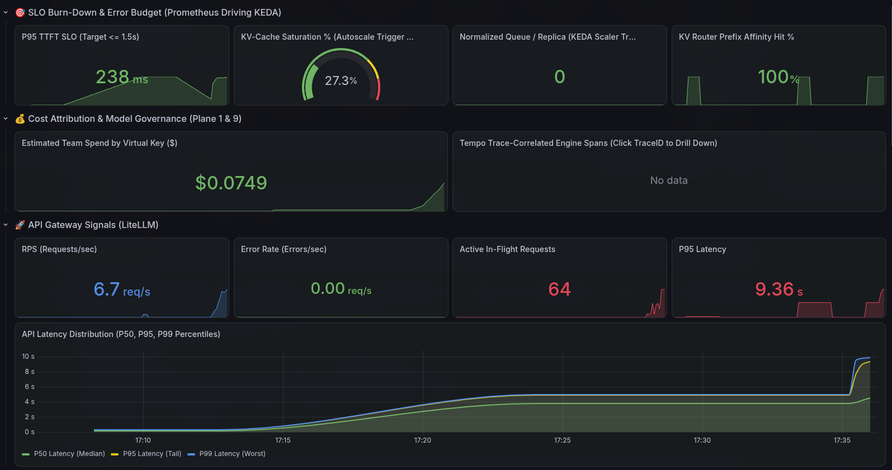
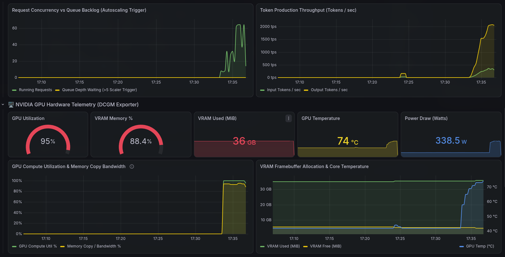

# LLMOps Platform

> **One architecture · any Hugging Face model · any hardware.**
> Self-hosted LLM serving with gateway governance, routing, observability, autoscaling and quality gates.

<p align="center">
  
  <br>
  
</p>
<p align="center"><sub><b>Live Grafana dashboard</b> · Qwen3.5-9B on 1× A100 40 GB · load test 8 → 32 → 64 concurrent streams · 1,248/1,248 requests OK · ~2,000 tokens/s · GPU 95 %</sub></p>

```bash
./run_all.sh                                  # detect hardware → pick model → boot → verify
./run_all.sh --model <preset | any/hf-repo>   # serve a different model
```

---

## Table of Contents

| # | Section | # | Section |
| :-: | :--- | :-: | :--- |
| 1 | [Overview](#1-overview) | 9 | [Security](#9-security) |
| 2 | [Architecture](#2-architecture) | 10 | [Verification](#10-verification) |
| 3 | [Getting Started](#3-getting-started) | 11 | [Kubernetes](#11-kubernetes) |
| 4 | [Accessing the Stack](#4-accessing-the-stack) | 12 | [Configuration Reference](#12-configuration-reference) |
| 5 | [Models](#5-models) | 13 | [Runbooks](#13-runbooks) |
| 6 | [Platforms](#6-platforms) | 14 | [Troubleshooting](#14-troubleshooting) |
| 7 | [Using the Gateway](#7-using-the-gateway) | 15 | [Repository Layout](#15-repository-layout) |
| 8 | [Operations](#8-operations) | | |

---

## 1. Overview

| Capability | What it does | Built with |
| :--- | :--- | :--- |
| **Serve** | Any Hugging Face model; continuous batching; prefix caching | vLLM v0.31 |
| **Run anywhere** | NVIDIA CUDA · AMD ROCm · CPU · Apple Silicon — same architecture | Compose overlays · Kubernetes overlays |
| **Govern** | Virtual keys, budgets, rate limits, PII masking, response cache | LiteLLM · Postgres · Redis |
| **Route** | Prompt-prefix affinity across engine replicas | KV-cache-aware router |
| **Observe** | Metrics, alerts, logs, traces, LLM traces | Prometheus · Alertmanager · Loki · Tempo · Alloy · Langfuse · Grafana |
| **Scale** | Scale on queue backlog and KV-cache saturation | KEDA |
| **Qualify** | End-to-end checks, load test, eval gate, LLM-as-judge | `scripts/` test suite |

---

## 2. Architecture

### 2.1 System Architecture — 9 Planes

```text
                    ┌────────────────────────────────────────────────────────┐
                    │       API CLIENT  ·  MICROSERVICE  ·  OPENAI SDK       │
                    └───────────────────────────┬────────────────────────────┘
                                                │ POST /v1/chat/completions  (stream · tools · images)
                                                │ Bearer <team virtual key>  ·  W3C traceparent
                                                ▼
┌───────────────────────────────────────────────────────────────────────────────────────────────────────┐
│ 1. INGRESS & ROUTING PLANE                                                                            │
│    LiteLLM AI Gateway (:4000) - routes rendered from the .env model block                             │
│    • Team Virtual Keys (Postgres)   • Spend Limits & Budgets         • PII Masking Guardrail          │
│    • Redis Rate-Limit Sync          • Redis Response Cache           • traceparent Forwarded          │
│    • Aliases: <name> → router · <name>-thinking → router · <name>-direct → vLLM (fallback)            │
│    KV-Cache-Aware Router (:8001)                                                                      │
│    • Prefix-Hash Affinity           • Health-Tracked Backends        • Streaming Pass-Through         │
└──────────────────┬───────────────────────────────────────────────────┬────────────────────────────────┘
                   │ Forward via Router (:8000/v1)                     │ OTLP LLM traces (langfuse_otel)
                   ▼                                                   ▼
┌──────────────────────────────────────────────────┐ ┌──────────────────────────────────────────────────┐
│ 2. INFERENCE PLANE (vLLM v0.31)                  │ │ 6. LLM OBSERVABILITY PLANE (Langfuse v4)         │
│    • Any Hugging Face model (.env model block)   │ │    • Web + Worker (async ingestion queue)        │
│    • cuda | rocm | cpu | metal engines           │ │    • ClickHouse Analytics Store                  │
│    • Continuous Batching & PagedAttention        │ │    • MinIO Raw Payload Storage                   │
│    • Automatic Prefix Caching                    │ │    • Traces Keyed by Caller's W3C Trace ID       │
│    • Reasoning & Tool-Call Parsers               │ │    • Online LLM-as-Judge Scores Written Back     │
│    • Native OTLP Trace Export                    │ │    • Prompts, Completions, Tokens & Cost         │
└──────────┬───────────────────────────┬───────────┘ └──────────────────────────────────────────────────┘
           │ Logs & OTLP Spans         │
           │                           └──── /metrics (:8000) · 15 s scrape ──┐
           ▼                                                                  ▼
┌──────────────────────────────────────────────────┐ ┌──────────────────────────────────────────────────┐
│ 5. LOGS & TRACES PLANE                           │ │ 3. METRICS & ALERTING PLANE                      │
│    Grafana Alloy (:12345)                        │ │    Prometheus (:9090) - 15 s scrape:             │
│    • Docker Logs + OTLP from Gateway & Engine    │ │    vLLM :8000 · LiteLLM :9095 · router · Plane 4 │
│                                                  │ │    • Golden Signals: TTFT · ITL · KV-Cache %     │
│    Grafana Loki (:3100)                          │ │      Queue Backlog · Prefix-Cache Hits · Errors  │
│    • LogQL Log Storage                           │ │                                                  │
│                                                  │ │    Alertmanager (:9093)                          │
│    Grafana Tempo (:3200)                         │ │    • SLO Burn-Rate Alerts (fast + slow window)   │
│    • One Trace Spans Gateway + Engine            │ │    • Saturation & GPU Thermal Alerts             │
└───────────────┬──────────────────────────────────┘ └──────────────────────────────────┬───────────────┘
                │ LogQL · TraceQL                           ▲                           │ PromQL
                │ PromQL                                    │ scraped                   │ polling
                ▼                                                                       ▼
┌────────────────────────────────┐ ┌────────────────────────┴──────┐ ┌──────────────────────────────────┐
│ 7. VISUALIZATION PLANE         │ │ 4. HARDWARE TELEMETRY PLANE   │ │ 8. AUTOSCALING (KEDA · k8s only) │
│    Grafana (:3001)             │ │    • NVIDIA DCGM (:9400)      │ │    • Reads Prometheus Directly   │
│    • Dashboards Only           │ │      GPU util · VRAM · temp   │ │    • Queue Backlog / Replica > 4 │
│      (no control-loop role)    │ │    • node-exporter (:9100)    │ │    • KV-Cache Saturation > 80 %  │
│    • SLOs, Engine, GPU, Cost   │ │      CPU · RAM · disk · net   │ │    • 300 s Scale-Down Window     │
│    • Loki → Tempo Deep Links   │ │    • Platform stub off-NVIDIA │ │    • Karpenter GPU Nodes (EKS)   │
│                                │ │                               │ │                                  │
└────────────────────────────────┘ └───────────────────────────────┘ └──────────────────────────────────┘

┌───────────────────────────────────────────────────────────────────────────────────────────────────────┐
│ 9. MODEL LIFECYCLE & GOVERNANCE PLANE                                                                 │
│    • Model Block: one place defines the model for engine, gateway, keys & tests (.env)                │
│    • Presets + Auto-Profiling: any Hub repo configured from metadata (scripts/configure_model.py)     │
│    • Model Registry: pinned Hugging Face revisions & thresholds (models/catalog.yaml)                 │
│    • CI/CD Eval Gate: golden probes before promotion (scripts/eval_gate.py)                           │
│    • Online Evaluation: LLM-as-judge on live traffic (scripts/online_eval_judge.py)                   │
│    • Canary Rollouts: Argo Rollouts with SLO analysis (k8s/extras/argo-rollouts-vllm.yaml)            │
└───────────────────────────────────────────────────────────────────────────────────────────────────────┘
```

### 2.2 Planes

| # | Plane | Components | Responsibility |
| :-: | :--- | :--- | :--- |
| 1 | Ingress & Routing | LiteLLM, KV router, Postgres, Redis | auth · budgets · limits · PII masking · cache · prefix affinity |
| 2 | Inference | vLLM | batching · prefix caching · reasoning and tool-call parsing |
| 3 | Metrics & Alerting | Prometheus, Alertmanager | golden-signal rules · SLO burn-rate alerts |
| 4 | Hardware | DCGM exporter, node exporter | GPU and host telemetry |
| 5 | Logs & Traces | Alloy, Loki, Tempo | container logs · OTLP traces |
| 6 | LLM Observability | Langfuse v4 (ClickHouse, MinIO) | prompts · completions · cost · judge scores |
| 7 | Visualization | Grafana | dashboards only — never in a control loop |
| 8 | Autoscaling | KEDA (Kubernetes only) | scale vLLM on saturation signals |
| 9 | Model Lifecycle | model block, presets, eval gate, judge, Argo Rollouts | qualify and promote models |

### 2.3 End-to-End Request & Control Lifecycle

```text
Client App       LiteLLM (:4000)     KV Router (:8001)      vLLM (:8000)       Prometheus (:9090)        KEDA         Alloy · Tempo       Langfuse
    │                   │                    │                    │                     │                  │                │                 │
 1  │── POST /v1/chat ─>│                    │                    │                     │                  │                │                 │
 2  │                   │── auth · budget    │                    │                     │                  │                │                 │
    │                   │   PII mask · cache │                    │                     │                  │                │                 │
 3  │                   │── + traceparent ──>│                    │                     │                  │                │                 │
 4  │                   │                    │── hash prefix      │                     │                  │                │                 │
    │                   │                    │   → pick replica   │                     │                  │                │                 │
 5  │                   │                    │── proxy (stream) ─>│                     │                  │                │                 │
 6  │                   │                    │                    │── batch + prefix    │                  │                │                 │
    │                   │                    │                    │   KV-cache reuse    │                  │                │                 │
 7  │                   │                    │<── stream tokens ──│                     │                  │                │                 │
 8  │                   │<── stream tokens ──│                    │                     │                  │                │                 │
 9  │<── SSE · TTFT ────│                    │                    │                     │                  │                │                 │
    │                   │                    │                    │                     │                  │                │                 │
  ── [ ASYNCHRONOUS TELEMETRY & CONTROL LOOP ] ───────────────────────────────────────────────────────────────────────────────────────────────────────────
    │                   │                    │                    │                     │                  │                │                 │
10  │                   │┄┄ OTLP spans + logs ┄┄┄┄┄┄┄┄┄┄┄┄┄┄┄┄┄┄┄┄┄┄┄┄┄┄┄┄┄┄┄┄┄┄┄┄┄┄┄┄┄┄┄┄┄┄┄┄┄┄┄┄┄┄┄┄┄┄┄┄┄┄┄┄┄┄┄┄┄┄┄┄┄┄┄┄┄>│                 │
11  │                   │                    │                    │┄┄ OTLP spans + logs ┄┄┄┄┄┄┄┄┄┄┄┄┄┄┄┄┄┄┄┄┄┄┄┄┄┄┄┄┄┄┄┄┄┄┄>│                 │
12  │                   │┄┄ prompt · completion · tokens · cost ┄┄┄┄┄┄┄┄┄┄┄┄┄┄┄┄┄┄┄┄┄┄┄┄┄┄┄┄┄┄┄┄┄┄┄┄┄┄┄┄┄┄┄┄┄┄┄┄┄┄┄┄┄┄┄┄┄┄┄┄┄┄┄┄┄┄┄┄┄┄┄┄┄┄┄┄┄>│
13  │                   │                    │                    │<┄┄ scrape 15 s ┄┄┄┄┄│                  │                │                 │
14  │                   │<┄┄ scrape :9095 (internal) ┄┄┄┄┄┄┄┄┄┄┄┄┄┄┄┄┄┄┄┄┄┄┄┄┄┄┄┄┄┄┄┄┄┄┄│                  │                │                 │
15  │                   │                    │                    │                     │<┄┄ poll (k8s) ┄┄┄│                │                 │
16  │                   │                    │                    │<── scale 1..N (k8s) ───────────────────│                │                 │
    │                   │                    │                    │                     │                  │                │                 │
```

- **One trace id** — the caller's `traceparent` is continued by the gateway and forwarded to the engine; the bundled scripts start a fresh one per request.
- **Tempo** — gateway and engine spans land in a single trace.
- **Loki** — container logs; the router logs each request's `trace_id=`, which Grafana links to Tempo.
- **Langfuse** — the same trace id carries prompt, completion, cost and judge scores.

### 2.4 Configuration Flow

```text
┌─────────────────────┐      ┌──────────────────────────┐      ┌────────────────────────────────────────┐
│ Hugging Face Hub    │─────>│ configure_model.py       │─────>│ .env  MODEL BLOCK                      │
│ (metadata only)     │      │ preset | auto-profile    │      │ MODEL_NAME · VLLM_MODEL_ARGS · EVAL_*  │
└─────────────────────┘      └──────────────────────────┘      └───────────────────┬────────────────────┘
┌─────────────────────┐ preset that fits  ▲                                        │
│ detect_hardware.py  │───────────────────┘                                        │
│ VRAM · RAM · cores  │                                                            │
└─────────────────────┘                                                            │
                                                                                   │
          ┌────────────────────┬────────────────────┬────────────────────┬─────────┴──────────┐
          ▼                    ▼                    ▼                    ▼                    ▼
┌──────────────────┐ ┌──────────────────┐ ┌──────────────────┐ ┌──────────────────┐ ┌──────────────────┐
│ vLLM command     │ │ Gateway routes   │ │ Key scopes       │ │ Tests & gates    │ │ k8s ConfigMap    │
│ engine flags     │ │ model aliases    │ │ allowed models   │ │ capability-aware │ │ deploy_k8s.sh    │
└──────────────────┘ └──────────────────┘ └──────────────────┘ └──────────────────┘ └──────────────────┘
          ▲
          │ engine image + devices · sizing for this machine
┌─────────┴─────────────────────────────────────────────────────────────────────────────────────────────┐
│ Platform overlay      gpu · rocm · cpu · metal · mock                                                 │
│ run_all.sh at boot    preflight.py: free host ports · GPU memory fraction · gateway workers           │
│ On a failed boot      engine_doctor.py: context auto · fp16 · retry · smaller preset (saved in .env)  │
└───────────────────────────────────────────────────────────────────────────────────────────────────────┘
```

- **Model block** — the single place a model is defined; a model swap edits nothing else.
- **Platform overlay** — swaps only the engine image and device wiring.
- **Gateway routes** — rendered at start: `<name>`, `<name>-direct`, `<name>-thinking`.
- **Hardware fit** — `detect_hardware.py` picks the preset that fits; at boot `preflight.py` sizes engine + gateway for the machine and `engine_doctor.py` repairs a failed boot.

### 2.5 Network Exposure

```text
  ┌──────────────────┐                                                ┌──────────────────┐
  │ Internet         │                                                │ Your laptop      │
  └────────┬─────────┘                                                └────────┬─────────┘
           │ cloud firewall                                                    │ SSH tunnel
           │ TCP 3000 · 3001 · 4000                                            │ port 22
           ▼                                                                   ▼
┌──────────────────────────────────────────────────┐ ┌──────────────────────────────────────────────────┐
│ PUBLISHABLE · LOGIN REQUIRED                     │ │ SERVER-LOCAL · 127.0.0.1 · NO LOGIN              │
│                                                  │ │                                                  │
│ Gateway + UI   :4000   GATEWAY_BIND_ADDRESS      │ │ vLLM :8000 · KV router :8001                     │
│ Grafana        :3001   UI_BIND_ADDRESS           │ │ Prometheus :9090 · Alertmanager :9093            │
│ Langfuse       :3000   UI_BIND_ADDRESS           │ │ Loki :3100 · Tempo :3200 · Alloy :12345          │
│                                                  │ │ OTLP :4317/:4318 · DCGM :9400 · node :9100       │
│                                                  │ │ Postgres :5432 · Redis :6379                     │
└──────────────────────────────────────────────────┘ └──────────────────────────────────────────────────┘

┌───────────────────────────────────────────────────────────────────────────────────────────────────────┐
│ DOCKER NETWORK ONLY:  LiteLLM metrics :9095 · ClickHouse · MinIO (never published)                    │
└───────────────────────────────────────────────────────────────────────────────────────────────────────┘
```

- **Default** — every port binds to `127.0.0.1`.
- **Publishable** — only services with their own login (`GATEWAY_BIND_ADDRESS`, `UI_BIND_ADDRESS`).
- **Internal only** — LiteLLM metrics `:9095`, ClickHouse, MinIO never leave the Docker network.

### 2.6 Kubernetes Topology

```text
┌───────────────────────────────────────────────────────────────────────────────────────────────────────┐
│ namespace: llmops                                                                                     │
│       ┌─────────────────────────────── OTLP :4318 ────────────────────────────────────┐               │
│       │    ┌────── <name>-direct fallback ─────────────┐                              │               │
│  ┌────┴────┴────┐      ┌────────────────┐      ┌───────▼────────┐ OTLP :4317  ┌───────▼────────┐      │
│  │ litellm ×2   │─────>│ kv-router ×2   │─────>│ vllm ×1…8      │────────────>│ tempo          │      │
│  └──────┬───────┘      └────────────────┘      └────────────┬───┘             └────────────────┘      │
│         │                           scale replicas   ▲      │ /metrics                                │
│         │                         ┌──────────────────┘      │                                         │
│         ▼                         │                         ▼                                         │
│ ┌───────────────────┐     ┌───────┴────────┐       ┌──────────────────┐                               │
│ │ postgres · redis  │     │ KEDA           │<──────│ prometheus       │ also scrapes litellm          │
│ └───────────────────┘     └────────────────┘       └────────┬─────────┘ :9095 + kv-router, per pod    │
│                          backlog > 4 · KV > 80 %            ▼                                         │
│                                                    ┌──────────────────┐                               │
│                                                    │ alertmanager     │                               │
│                                                    └──────────────────┘                               │
│                                                                                                       │
└───────────────────────────────────────────────────────────────────────────────────────────────────────┘
 Not in k8s/base: Grafana · Loki · Langfuse (cluster-wide) · Alloy DaemonSet in k8s/extras/
```

---

## 3. Getting Started

### 3.1 Requirements

| Platform | Needs |
| :--- | :--- |
| NVIDIA GPU host | Ubuntu 22.04/24.04 with the NVIDIA driver; Docker + NVIDIA toolkit are installed by `run_all.sh` when missing (passwordless sudo) |
| CPU host / laptop | Docker, Python 3.8+ (Compose older than v2.24 is replaced by a pinned release in `~/.docker/cli-plugins`) |
| Apple Silicon | macOS 15+, Docker Desktop, Homebrew (vllm-metal is installed by `run_all.sh`) |

### 3.2 Cloud GPU Host

```bash
git clone <repo> && cd LLMOps
./run_all.sh                       # installs what is missing, boots, warms up, verifies
```

- **No NVIDIA driver yet** — `bash scripts/bootstrap_host.sh` once (driver installs are never automatic).

### 3.3 CPU Host

```bash
./run_all.sh                       # no usable GPU: real inference on vLLM's CPU backend
./run_all.sh --cpu                 # force CPU on a GPU host
```

- **Preset** — `qwen3-4b` with ≥ 16 threads and ≥ 24 GB RAM, else `smollm2-360m`.

### 3.4 Apple Silicon

```bash
./run_all.sh                       # installs vllm-metal, starts the native engine, rest in Docker
```

- **Preset** — `qwen3-4b` with ≥ 16 GB unified memory, else `smollm2-360m`.
- **No Homebrew / vllm-metal** — the engine runs on CPU in Docker instead.

### 3.5 No Model (UI / pipeline development)

```bash
./run_all.sh --mock                # emulated engine with real vLLM metric names
```

### 3.6 What Every Run Does

- **Never prompts** — every decision is automatic and listed under *Fixed automatically* in the final report.
- **Secrets** — the first run creates `.env` with fresh keys and passwords; later runs only add new ones.
- **Model** — the first run picks the preset for the hardware; a platform change re-sizes it.
- **Ports** — a port used by another program moves to the next free one (saved in `.env`).
- **Sizing** — the engine takes the GPU with the most free memory and sizes itself to it; gateway workers follow CPU threads; CPU KV cache follows RAM.
- **Engine recovery** — a failed boot gets context `auto`, fp16, a retry, a smaller preset, and finally the CPU; a model dropped because the GPU was shared is retried next run.
- **Database & keys** — the Postgres password is re-synced with `.env`; team keys left by a lost `.env` are retired and the seed keys re-issued.
- **Timing** — cold start ≈ 3.5 min (9B on A100, includes 19 GB download); warm restart ≈ 80 s.

---

## 4. Accessing the Stack

### 4.1 Endpoints

| Service | Port | Path | Login | Public |
| :--- | :-: | :--- | :--- | :-: |
| Gateway API | 4000 | `/v1` | Bearer `TEAM_ENGINEERING_KEY` | ✅ |
| LiteLLM admin UI | 4000 | `/ui` | `admin` + `LITELLM_MASTER_KEY` | ✅ |
| Grafana | 3001 | `/` | `admin` + `GF_SECURITY_ADMIN_PASSWORD` | ✅ |
| Langfuse | 3000 | `/` | `LANGFUSE_ADMIN_EMAIL` + `LANGFUSE_ADMIN_PASSWORD` | ✅ |
| Prometheus | 9090 | `/` | none | ❌ |
| Alertmanager | 9093 | `/` | none | ❌ |
| vLLM | 8000 | `/docs` | none | ❌ |
| KV router | 8001 | `/health` | none | ❌ |
| Tempo · Loki · Alloy | 3200 · 3100 · 12345 | `/` | none | ❌ |

### 4.2 Credentials

```bash
grep -E '^(TEAM_ENGINEERING_KEY|LITELLM_MASTER_KEY|GF_SECURITY_ADMIN_PASSWORD|LANGFUSE_ADMIN_(EMAIL|PASSWORD))=' .env
```

### 4.3 Option A — SSH Tunnel (default)

```bash
ssh -N -L 4000:localhost:4000 -L 3001:localhost:3001 -L 3000:localhost:3000 \
       -L 9090:localhost:9090 ubuntu@<server-ip>
```

- Open `http://localhost:<port>` on your laptop.
- Nothing is exposed to the internet.

### 4.4 Option B — Public URLs

1. **Edit `.env`**
   ```bash
   GATEWAY_BIND_ADDRESS=0.0.0.0
   UI_BIND_ADDRESS=0.0.0.0
   PUBLIC_HOST=<server-ip>
   NEXTAUTH_URL=http://<server-ip>:3000
   ```
2. **Apply** — `./run_all.sh --skip-tests`
3. **Open the cloud firewall** — inbound TCP `3000-3001` and `4000`, source = your IP
   (Lambda Cloud: dashboard → **Firewall**; only SSH is open by default)
4. **Browse** — `http://<server-ip>:3001` (Grafana), `:3000` (Langfuse), `:4000/ui` (LiteLLM)

> ⚠️ **Plain HTTP:** passwords and API keys travel unencrypted. Restrict the firewall to your IP and add TLS before wider use.

---

## 5. Models

### 5.1 Choose a Model

```bash
python3 scripts/configure_model.py --list                 # curated presets
python3 scripts/configure_model.py qwen3.5-9b             # apply a preset
python3 scripts/configure_model.py openai/gpt-oss-20b     # any Hub repo (auto-profiled)
./run_all.sh --model <preset | repo>                      # configure + deploy + verify
```

### 5.2 Presets

| Preset | Model | Best for | Verified on |
| :--- | :--- | :--- | :--- |
| `qwen3.5-9b` | Qwen/Qwen3.5-9B — vision, tools, thinking, 128K | ≥ 24 GB accelerators | A100-40GB |
| `qwen3-4b` | Qwen/Qwen3-4B — tools, thinking | CPU hosts, 10–24 GB GPUs | 30-core EPYC CPU |
| `smollm2-360m` | HuggingFaceTB/SmolLM2-360M-Instruct | 4 GB dev GPUs, smoke tests | — |

### 5.3 Auto-Profiling (any repo)

Reads Hub metadata only — no weights downloaded.

| Setting | Derived from |
| :--- | :--- |
| Reasoning parser | model family (`qwen3`, `openai_gptoss`, `granite`, `glm45`, generic `<think>`) |
| Tool-call parser | family + chat template (`qwen3_coder`, `hermes`, `llama3_json`, `mistral`, …) |
| Thinking toggle | `enable_thinking` / `thinking` in the template |
| Vision support | `vision_config` / `image-text-to-text` |
| Context length | `auto` — largest that fits memory |
| Quality gates | fixed bar; speed SLOs relaxed on CPU / Metal |
| Warnings | gated repos (`HF_TOKEN`), weight-memory estimate |

### 5.4 Gateway Aliases

| Alias | Path | Behaviour |
| :--- | :--- | :--- |
| `<name>` | gateway → router → vLLM | answers directly (default) |
| `<name>-thinking` | gateway → router → vLLM | reasoning returned separately (reasoning models) |
| `<name>-direct` | gateway → vLLM | bypasses the router · fallback target |

---

## 6. Platforms

| Platform | Overlay | Engine image | GPU telemetry | Status |
| :--- | :--- | :--- | :--- | :--- |
| NVIDIA CUDA | `docker-compose.gpu.yml` | `vllm/vllm-openai` | DCGM | ✅ verified (A100) |
| CPU (x86_64 / arm64) | `docker-compose.cpu.yml` | `vllm/vllm-openai-cpu` | — | ✅ verified (EPYC) |
| AMD ROCm | `docker-compose.rocm.yml` | `vllm/vllm-openai-rocm` | — | not verified |
| Apple Silicon | `docker-compose.metal.yml` | native `vllm-metal` | — | not verified |
| Mock | `docker-compose.mock.yml` | emulator | synthetic | emulation only |

- **Auto-detection** — Metal → CUDA → ROCm → CPU (`scripts/detect_hardware.py`).
- **ROCm** — needs `rocm-smi` and ≥ 8 GB VRAM; integrated AMD graphics run on CPU.
- **Old NVIDIA GPUs** — compute capability < 7.0 (pre-Volta) run on CPU.
- **SELinux (Fedora / RHEL)** — `docker-compose.selinux.yml` is added automatically when enforcing.
- **GPU Docker cannot use** — NVIDIA toolkit installed automatically (Linux, passwordless sudo, no other containers running), else CPU.
- **Override** — `./run_all.sh --platform cuda | rocm | cpu | metal | mock`; a platform the machine cannot run falls back to the detected one.
- **Same engine** — vLLM `v0.31.0` everywhere: identical API, metrics and tests.

---

## 7. Using the Gateway

### 7.1 cURL

```bash
KEY=$(grep ^TEAM_ENGINEERING_KEY .env | cut -d= -f2)
curl -N http://localhost:4000/v1/chat/completions \
  -H "Authorization: Bearer $KEY" -H "Content-Type: application/json" \
  -d '{"model": "qwen3.5-9b", "stream": true,
       "messages": [{"role": "user", "content": "Explain KV-cache prefix affinity in one sentence."}]}'
```

### 7.2 Python

```python
from openai import OpenAI
client = OpenAI(base_url="http://localhost:4000/v1", api_key="<TEAM_ENGINEERING_KEY>")

# direct answer
client.chat.completions.create(model="qwen3.5-9b",
    messages=[{"role": "user", "content": "Capital of France?"}])

# reasoning (returned separately from the answer)
client.chat.completions.create(model="qwen3.5-9b-thinking", max_tokens=2048,
    messages=[{"role": "user", "content": "What is 17 * 23?"}])

# vision
client.chat.completions.create(model="qwen3.5-9b", messages=[{"role": "user", "content": [
    {"type": "image_url", "image_url": {"url": "https://example.com/cat.png"}},
    {"type": "text", "text": "What is in this image?"}]}])
```

### 7.3 Request Options

| Option | How |
| :--- | :--- |
| Skip the response cache | body: `"cache": {"no-cache": true}` |
| Correlate across Tempo / Loki / Langfuse | header: `traceparent: 00-<trace-id>-<span-id>-01` |
| More examples | `python3 scripts/inference_example.py` |

---

## 8. Operations

### 8.1 Stack

| Task | Command |
| :--- | :--- |
| Start / redeploy + verify | `./run_all.sh` |
| Start only | `./run_all.sh --skip-tests` |
| Verify a running stack | `./run_all.sh --test` |
| Switch model | `./run_all.sh --model <preset \| repo>` |
| Stop (keeps data) | `./run_all.sh --down` |
| Engine logs | `docker logs -f vllm-inference` |
| Reload Prometheus rules | `curl -X POST localhost:9090/-/reload` |

### 8.2 Keys, Quality & Data

| Task | Command |
| :--- | :--- |
| Issue a team key | `python3 scripts/manage_keys.py generate --team <t> --alias <a> --budget 50` |
| Key spend / limits | `python3 scripts/manage_keys.py info --key <sk-...>` |
| Rotate master key | `bash scripts/rotate_master_key.sh` |
| Load test | `CONCURRENCY=32 python3 scripts/load_test.py` |
| Quality gate | `python3 scripts/eval_gate.py` |
| Score live traffic | `python3 scripts/online_eval_judge.py --sample 10` |
| Back up Postgres | `docker exec llmops-postgres pg_dump -U llmops_admin litellm_db > backup.sql` |
| Restore Postgres | `docker exec -i llmops-postgres psql -U llmops_admin litellm_db < backup.sql` |

### 8.3 Lifecycle

- **Reboots** — containers restart automatically (`restart: unless-stopped`).
- **Upgrades** — images are pinned; bump `VLLM_VERSION`, `LITELLM_IMAGE_TAG`, `LANGFUSE_VERSION`, … then `./run_all.sh`.
- **New secrets** — appended to an existing `.env` automatically; existing values never change.
- **Ephemeral clouds** — keep repo + `.env` + `HF_CACHE_DIR` on persistent storage; back up Postgres before terminating.

---

## 9. Security

| Area | Control |
| :--- | :--- |
| Network | all ports `127.0.0.1` by default; only login-protected services publishable |
| Secrets | generated per deployment; `.env` mode `600` |
| Keys | master key admin-only; per-team virtual keys with budgets + RPM/TPM limits |
| Metrics | gateway `/metrics` needs a key; Prometheus reads an internal-only port |
| PII | masked before inference (e-mail, card, SSN, API keys) — never reaches model, cache, logs, traces |
| Retention | Prometheus 30 days; prompts not stored in spend logs |
| Tests | never fall back to the master key |

---

## 10. Verification

### 10.1 Gates (end of every `run_all.sh`)

| Gate | Checks |
| :--- | :--- |
| `test_stack.py` | 13 checks: engine · router · streaming · thinking · vision · auth · PII · Prometheus · Alertmanager · Tempo trace · Loki log for the same trace id · Langfuse · Grafana (GPU telemetry reported, not required) |
| `load_test.py` | concurrent streaming burst: TTFT / latency percentiles, saturation, KEDA trigger state |
| `eval_gate.py` | accuracy · injection + PII safety · formatting · arithmetic · tool calling |
| `online_eval_judge.py` | scores live generations from Langfuse (schema-constrained verdicts), writes scores back; `JUDGE_MODEL` picks a stronger judge than the served model |

### 10.2 Verified Results (Lambda Cloud, 2026-10-08)

| Platform · Model | Checks | Eval gate | Load burst |
| :--- | :-: | :--- | :--- |
| A100 · Qwen3.5-9B | 13/13 | 8/8 · P95 TTFT 0.11 s · 74 tok/s | 32/32 · 1455 tok/s |
| A100 · gpt-oss-20b (auto-profiled) | 11/11 | 7/8 (pass) · 213 tok/s | 32/32 · 1912 tok/s |
| CPU · Qwen3-4B | 13/13 | 8/8 · P95 TTFT 1.67 s · 9.9 tok/s | 8/8 · 23 tok/s |
| CPU · Qwen3-0.6B / 1.7B | 12/12 | rejected (4/8) — weak model | — |
| Mock engine | 11/11 | skipped | 32/32 |
| k3s · Qwen3.5-9B | 10/10 | — | KEDA scaled 1 → 8 |

### 10.3 Self-Healing Scenarios (`./run_all.sh`, A100 host, 2026-10-08)

| Scenario | What `run_all.sh` did | Result |
| :--- | :--- | :--- |
| Plain re-run | 8 gateway workers (auto), ports free | 13/13 · eval 8/8 · 32/32 streams |
| Ports 5432 + 9100 taken, 20 GiB of GPU held | ports → 5433 / 9101, memory 0.45, 9B → 4B | 13/13 · eval 100 % |
| GPU free again | retried and restored the 9B | 13/13 · eval 100 % |
| `--cpu` (platform switch) | model re-sized to `qwen3-4b`, 2 workers, KV 8 GiB | 13/13 · eval 100 % · 9.8 tok/s |
| CPU + `smollm2-360m` (laptop path) | — (found a judge bug, fixed) | 13/13 · eval 57 % (gate 40 %) |
| 4 GB-class GPU (4.1 GiB free) | 9B → 4B → `smollm2-360m` | 13/13 · eval 71 % |
| GPU full (0.5 GiB free) | engine on CPU this run | 13/13 · eval 100 % |
| `.env` lost, old databases | new secrets, DB re-synced, stale keys retired | 13/13 · eval 100 % |
| Original `.env` restored | DB re-synced, original keys re-issued | 13/13 · eval 100 % · 74 tok/s |

---

## 11. Kubernetes

### 11.1 Deploy

```bash
./scripts/deploy_k8s.sh cuda --verify      # or: rocm | cpu
```

- Installs KEDA and (when needed) the NVIDIA device plugin.
- Applies the overlay, waits for rollouts, seeds keys.
- `--verify` runs the same test suite through port-forwards.

### 11.2 Layout

| Path | Contents |
| :--- | :--- |
| `k8s/base/` | Postgres, Redis, vLLM, KV router, LiteLLM, Prometheus, Alertmanager, Tempo, KEDA |
| `k8s/overlays/` | `cuda` · `cuda-runtimeclass` (k3s) · `rocm` · `cpu` |
| `k8s/extras/` | Argo Rollouts canary · Karpenter · Gateway API · Alloy · kind |

- **Same inputs as Compose** — model block + secrets from `.env`; configs from the repo.
- **Not in the base** — Grafana, Loki, Langfuse (use cluster-wide instances). For LLM traces, add `LANGFUSE_HOST`, `LANGFUSE_PUBLIC_KEY`, `LANGFUSE_SECRET_KEY` to the LiteLLM env in `k8s/base/litellm.yaml`.

### 11.3 Single-Node Test Cluster (k3s)

```bash
curl -sfL https://get.k3s.io | INSTALL_K3S_EXEC="--disable traefik --write-kubeconfig-mode 644" sh -
KUBECONFIG=/etc/rancher/k3s/k3s.yaml ./scripts/deploy_k8s.sh cuda --verify
/usr/local/bin/k3s-uninstall.sh            # remove afterwards
```

---

## 12. Configuration Reference

All settings live in `.env` (template: `.env.example`).

| Group | Keys |
| :--- | :--- |
| Model | `MODEL_NAME` · `MODEL_REVISION` · `SERVED_MODEL_NAME` |
| Engine sizing | `MODEL_DTYPE` · `MAX_MODEL_LEN` · `GPU_MEMORY_UTILIZATION` · `GPU_COUNT` (GPUs used; the emptiest are picked) |
| Auto when empty | `LITELLM_NUM_WORKERS` · `VLLM_CPU_KVCACHE_SPACE` |
| Boot patience | `VLLM_READY_TIMEOUT` (seconds without engine progress) |
| Host ports | `VLLM_PORT` · `ROUTER_PORT` · `LITELLM_PORT` · `LANGFUSE_PORT` · `GRAFANA_PORT` · `PROMETHEUS_PORT` · `ALERTMANAGER_PORT` · `LOKI_PORT` · `TEMPO_PORT` · `ALLOY_PORT` · `OTLP_GRPC_PORT` · `OTLP_HTTP_PORT` · `POSTGRES_PORT` · `REDIS_PORT` · `DCGM_PORT` · `NODE_EXPORTER_PORT` |
| Kept by `run_all.sh` | `MODEL_PLATFORM` · `MODEL_FALLBACK_FROM` |
| Engine flags | `VLLM_MODEL_ARGS` (configurator-owned) · `VLLM_EXTRA_ARGS` (yours) |
| Capabilities | `MODEL_SUPPORTS_REASONING` · `_TOOLS` · `_VISION` · `MODEL_REASONING_BY_DEFAULT` · `MODEL_THINKING_EXTRA_BODY` |
| Quality gates | `EVAL_MIN_ACCURACY` · `EVAL_MAX_TTFT` · `EVAL_MIN_TPS` |
| Exposure | `BIND_ADDRESS` · `GATEWAY_BIND_ADDRESS` · `UI_BIND_ADDRESS` · `PUBLIC_HOST` · `NEXTAUTH_URL` |
| Versions | `VLLM_VERSION` · `LITELLM_IMAGE_TAG` · `LANGFUSE_VERSION` · `GRAFANA_IMAGE_TAG` · … |
| Hugging Face | `HF_TOKEN` · `HF_CACHE_DIR` |

---

## 13. Runbooks

### 13.1 TTFT SLO Breach

- **Alert** — `LLMHighTTFTSLOBurnRate*` (`job:vllm_time_to_first_token_seconds_p95 > 1.5 s`).
- **Queueing?** — `vllm:request_queue_time_seconds` rising → scale out.
- **Cold prefixes?** — `job:vllm_prefix_cache_hit_percent`, `job:kv_router_affinity_hit_percent`.
- **Where?** — open the trace in Tempo; compare gateway vs engine span time.
- **Gateway-bound?** — client TTFT ≫ engine TTFT → gateway CPU saturated: raise `LITELLM_NUM_WORKERS` (2 → 8 took P95 1.8 s → 0.4 s at 64 streams).

### 13.2 KV-Cache Saturation

- **Alert** — `LLMKVCacheSaturationCritical` (`job:vllm_kv_cache_usage_ratio > 0.85`).
- **Kubernetes** — KEDA scales out above 80 %.
- **Single host** — lower `MAX_MODEL_LEN` or raise `GPU_MEMORY_UTILIZATION`.

### 13.3 Model Rollout

- **Compose** — `configure_model.py` → `./run_all.sh` (eval gate runs on the candidate).
- **Kubernetes** — Argo Rollouts canary in `k8s/extras/` with the same SLO queries.

---

## 14. Troubleshooting

| Symptom | Fix |
| :--- | :--- |
| `AMD CDI spec not found` | run `bash scripts/bootstrap_host.sh` (registers NVIDIA runtime, restarts Docker) |
| Engine stuck on `health: starting` | first boot downloads + compiles; `run_all.sh` waits while it progresses (`VLLM_READY_TIMEOUT` = seconds without progress) |
| First CPU request ≈ 1 min | one-time JIT; `run_all.sh` warms up automatically |
| `config.json not readable (gated)` | accept the license on huggingface.co, set `HF_TOKEN` (meanwhile the recommended preset is served) |
| Engine OOM / max-seq-len error | fixed automatically (context `auto`, then a smaller preset) — see *Fixed automatically* |
| `Driver/library version mismatch` | NVIDIA driver updated without a reboot: reboot (the stack runs on CPU until then) |
| A port moved (e.g. Grafana on 3002) | another program held the default: free it, set the `*_PORT` back in `.env` |
| Client TTFT ≫ engine TTFT | gateway CPU-bound: raise `LITELLM_NUM_WORKERS` |
| Public URL times out | open the port in the **cloud** firewall; check `*_BIND_ADDRESS` |
| Langfuse login bounces to `localhost` | set `NEXTAUTH_URL=http://<server-ip>:3000`, recreate Langfuse |
| `.env` deleted | a new one is generated, the Postgres password re-synced and the old team keys retired (they stop working) |
| `stale file handle` after `git pull` | `docker compose … up -d --force-recreate <service>` |

---

## 15. Repository Layout

```text
LLMOps/
├── run_all.sh                     # detect · size · boot · self-heal · verify
├── docker-compose.yml             # base architecture
├── docker-compose.{gpu,rocm,cpu,metal,mock}.yml   # platform overlays
├── docker-compose.selinux.yml     # added on SELinux-enforcing hosts
├── .env.example                   # model block · exposure · versions · secrets
├── config/
│   ├── litellm.yaml               # gateway policy
│   ├── render_litellm_config.py   # gateway routes from the model block
│   ├── pii_guardrail.py           # PII masking
│   ├── prometheus*.yaml           # scrape config · rules · alerts
│   ├── alertmanager.yaml · alloy.config · loki.yaml · tempo.yaml
│   ├── grafana-*.yaml · llmops-dashboard.json
│   └── profiles/                  # hardware tier notes
├── router/kv_router.py            # KV-cache-aware router
├── engine/                        # mock engine · hardware-exporter stub
├── docs/images/                   # README screenshots
├── models/
│   ├── presets/*.env              # verified model blocks
│   ├── catalog.yaml               # model registry
│   ├── golden_dataset.jsonl       # eval probes
│   └── retention_policy.yaml
├── k8s/
│   ├── base/                      # kustomize base
│   ├── overlays/                  # cuda · cuda-runtimeclass · rocm · cpu
│   └── extras/                    # Argo Rollouts · Karpenter · Gateway API · Alloy · kind
└── scripts/
    ├── bootstrap_host.sh          # GPU host setup
    ├── configure_model.py         # presets / auto-profile
    ├── init_env.py                # secrets
    ├── detect_hardware.py         # platform detection
    ├── preflight.py               # host ports · sizing for this machine
    ├── engine_doctor.py           # engine boot failure -> fix
    ├── deploy_k8s.sh              # Kubernetes deploy
    ├── llmops_client.py           # shared client
    ├── test_stack.py · load_test.py · eval_gate.py · online_eval_judge.py
    ├── manage_keys.py · rotate_master_key.sh · inference_example.py
    └── serve_metal.py             # Apple Silicon engine
```
